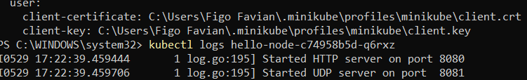
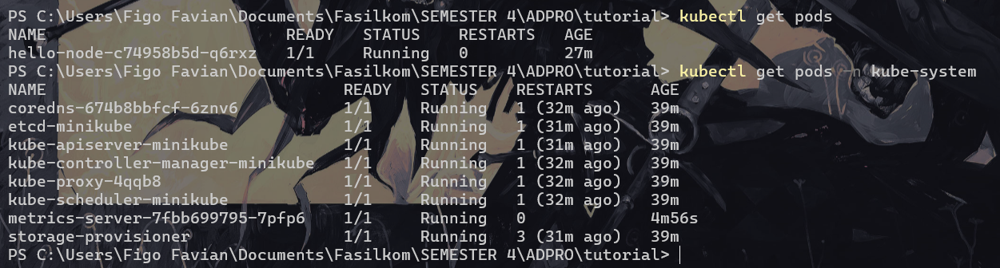
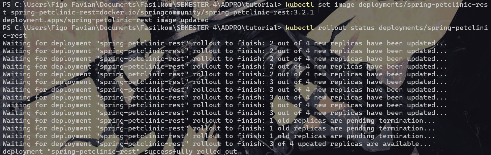
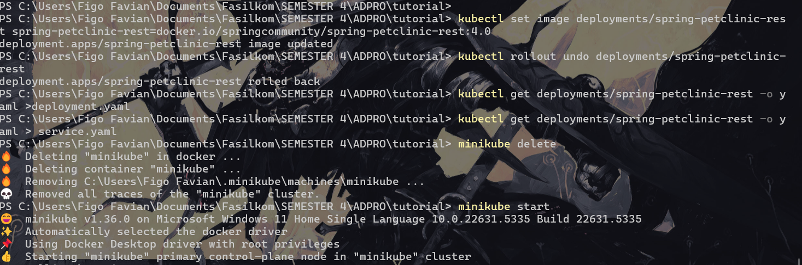
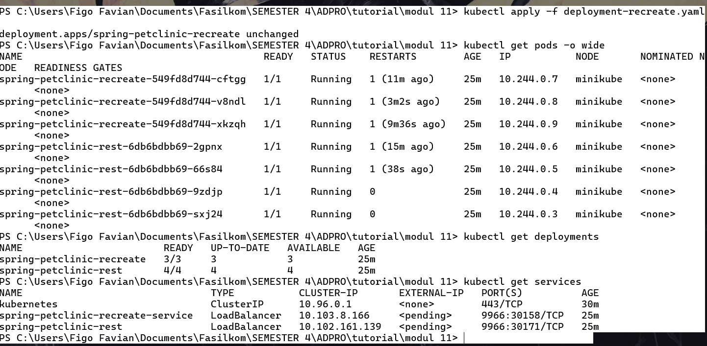

### 1. Compare the application logs before and after you exposed it as a Service. Try to open the app several times while the proxy into the Service is running. What do you see in the logs? Does the number of logs increase each time you open the app?



The image above shows the before and after (before at the top, the after is below) and yes, the Service is successfully routing external traffic to the Pod. This is due to he increasing tnumber of logs every time the app gets accessed because each HTTP request to the service is logged by the application.  

### 2. Notice that there are two versions of kubectl get invocation during this tutorial section. The first does not have any option, while the latter has -n option with value set to kube-system. What is the purpose of the -n option and why did the output not list the pods/services that you



"-n" is used to specify which Kubernetes namespace to query or operate on. Without it, hello-node deployment and service is shown because it is showed resources in the default namespace, which included our hello-node deployment and service. 

The output of kubectl get pods,services -n kube-system didn't list the pods/services we explicitly created because those were created in the default namespace, while the -n kube-system command only shows resources in the kube-system namespace. Kubernetes uses namespaces to logically separate and organize resources which provides isolation between different applications or environments.

But if i ran kubectl get services and kubectl get pods then it showed resources in the default namespace, which included our hello-node deployment and service.






### 3. What is the difference between Rolling Update and Recreate deployment strategy?

In a Rolling Update, Kubernetes replaces Pods one by one so the application stays available throughout the upgrade. Roll back is an option if something goes wrong. By contrast, the Recreate strategy tears down all old Pods before bringing up the new ones, which creates a window of downtime but guarantees there are never two versions running at the same time. Rolling updates minimize service disruption, whereas Recreate is simpler and sometimes necessary if two versions cannot coexist, for example, when they share a PVC.

### 4. Deploying the Spring Petclinic REST App with Recreate

First I applied the rolling-update Deployment and Service by:

```bash
kubectl apply -f deployment.yaml

kubectl apply -f service.yaml
```

Next, I applied the recreate Deployment and its Service:

```bash
kubectl apply -f deployment-recreate.yaml

kubectl apply -f service-recreate.yaml
```


Then I watched until they all reached Running/Ready with kubectl get pods -o wide. After that i confirmed that both Deployments and Services exist with kubectl get deployments and kubectl get services



Both sets of Pods reached Running and Ready states within a minute, and I could verify in the logs that traffic to each Service was being properly routed.

### 5. Reflection on Manifest-Driven Deployments

Initial Pod Creation: Seeing ContainerCreating reminds us that Pods go through a startup phase image pull, volume mount, network setup—before serving traffic. 

Rolling Update vs. Recreate: Rolling Update replaced Pods one at a time, no downtime seen once all new Pods were up. Meanwhile recreate terminated all old Pods first, causing a brief outage while the new Pods spun up.

Clarity & Reproducibility: Keeping these YAMLs in Git means anyone can reproduce the cluster with kubectl apply -f, and rollbacks are as simple as reverting the manifest.

CI/CD Integration: Declarative files integrate seamlessly with pipelines: linting, validation, and automated deploys ensure consistency across environments.

Overall, manifest files turned a manual and error-prone process into a repeatable and auditable workflow that scales far better than one-off kubectl commands.